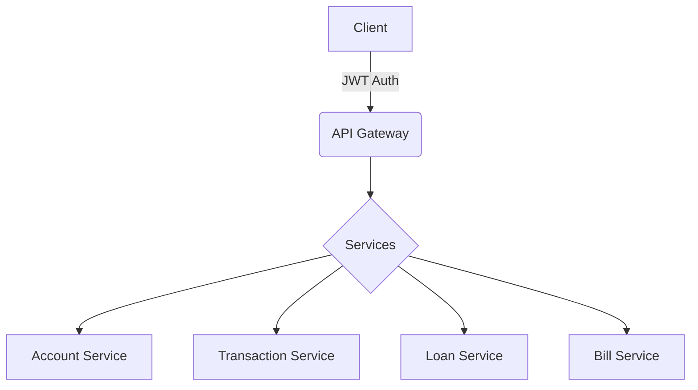

# 🏦 Modern Bank Management System

<div align="center">


A modern, secure, and user-friendly banking system built with cutting-edge web technologies.

[Demo](http://your-demo-link.com) • [Documentation](docs/) • [Report Bug](issues/) • [Request Feature](issues/)

</div>

---

## ✨ Features

### 🔐 Authentication & Security
- **JWT-based Authentication**
- **Role-based Access Control** (Admin, Employee, User)
- **Secure Password Management**
- **Session Handling**

### 💳 Account Management
- **Multi-account Support**
- **Real-time Balance Updates**
- **Transaction History**
- **Account Analytics**

### 💸 Transactions
- **Instant Transfers**
- **Scheduled Payments**
- **Transaction Verification**
- **Transfer Limits**

### 💰 Loan System
- **Smart Loan Applications**
- **Automated Credit Scoring**
- **Flexible Repayment Options**
- **Interest Calculators**

### 📊 Advanced Dashboard
- **Real-time Analytics**
- **Transaction Insights**
- **Account Overview**
- **Financial Reports**

## 🚀 Quick Start

### Prerequisites

```bash
node -v     # v18 or higher
npm -v      # v9 or higher
```

### Installation

1️⃣ Clone the repository
```bash
git clone https://github.com/yourusername/bank-management.git
cd bank-management
```

2️⃣ Install dependencies
```bash
npm install
```

3️⃣ Start the development server
```bash
ng serve
```

4️⃣ Open your browser and navigate to `http://localhost:4200`

## 🏗️ Architecture



## 📁 Project Structure

```
src/
├── 🔒 app/auth/          # Authentication
├── 🛠️ app/core/          # Core services
├── 📱 app/features/      # Feature modules
├── 🔄 app/shared/        # Shared components
└── ⚙️ environments/      # Environment configs
```

## 🧪 Testing

Run tests with style:

```bash
# Run e2e tests
npm run cypress:open

# Unit tests
ng test
```

## 🛡️ Security Features

- ✅ JWT Authentication
- ✅ Role-based Authorization
- ✅ XSS Protection
- ✅ CSRF Protection
- ✅ Rate Limiting
- ✅ Input Validation
- ✅ Secure Password Hashing

## 📚 API Documentation

RESTful endpoints available at:

- `POST /api/auth/login` - User authentication
- `GET /api/accounts` - Retrieve accounts
- `POST /api/transactions` - Create transaction
- `GET /api/loans` - Retrieve loans
- `POST /api/bills/pay` - Process bill payment

## 🎨 UI Screenshots

<div align="center">


</div>

## 🤝 Contributing

1. Fork the Project
2. Create your Feature Branch (`git checkout -b feature/AmazingFeature`)
3. Commit your Changes (`git commit -m 'Add some AmazingFeature'`)
4. Push to the Branch (`git push origin feature/AmazingFeature`)
5. Open a Pull Request

## 📝 License

Distributed under the MIT License. See `LICENSE` for more information.

## 🌟 Acknowledgments

- Angular Team for the amazing framework
- TailwindCSS for the beautiful styling
- Our amazing contributors

---

<div align="center">

Made with ❤️ by Your Team

[⬆ back to top](#modern-bank-management-system)

</div>